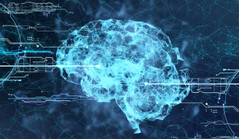

<link rel="stylesheet" href="theme/css/main.css" />
<link rel="shortcut icon" type="image/x-icon" href="favicon.ico">

Introductory Machine Learning
====

S&DS 265 introduces some of the key ideas and techniques in machine learning. Basic algorithms and concepts are presented to build intuition for how different methods work, without advanced mathematics. Assignments give students hands-on experience with the methods on different types of data. Topics include linear regression and classification, tree-based methods, topic models, language models, word embeddings, basic two-layer and recurrent neural networks, reinforcement learning, and an introduction to deep learning. Examples come from a variety of sources including political speeches, archives of scientific articles, real estate listings, and natural images. Programming is central to the course, and is based on the Python programming language and Jupyter notebooks.

Computing for the course uses Python in Jupyter notebooks. These can be run using [Anaconda](https://www.anaconda.com/products/individual) with the [iML environment](https://github.com/YData123/sds265-fa21/tree/main/env/iml_env.yml) adopted by the course; instructions for installing this environment are available on [Yale Canvas](https://canvas.yale.edu).  Alternatively, the notebooks can be run in [Google Colab](https://colab.research.google.com).

Calendar Fall 2021
---
Lectures: Tuesday/Thursday 9:00-10:20

 Week | Dates |  Topics | Lecture Materials | Readings | Assignments
----------- | ----------- | ------------- | ------------ | ------------- | -----------
1 | Sept 9/2 |     Course overview | [Slides](https://github.com/YData123/sds265-fa21/raw/main/lectures/lecture-sept-02.pdf) |
2 | Sept 7, 9 |    Python and background concepts | [Example notebook](https://github.com/YData123/sds265-fa21/tree/main/demos/jupyter/jupyter-python.ipynb)    [Slides](https://github.com/YData123/sds123-sp21/raw/main/lectures/ydata_lecture_01.pdf) | [Data8 Chapters 3](https://www.inferentialthinking.com/chapters/03/programming-in-python.html), [4](https://www.inferentialthinking.com/chapters/04/Data_Types.html), [5](https://www.inferentialthinking.com/chapters/05/Sequences.html) | Quiz 0
3 | Sept 14, 16 | Linear regression and classification | [Classification examples](https://github.com/YData123/sds265-fa21/blob/main/demos/classification/classification-examples.ipynb)  |  | Assn 1 out
4 | Sept 21, 23 | Sochastic gradient descent | [SGD example](https://github.com/YData123/sds265-fa21/blob/main/demos/sgd/sgd-example.ipynb)  |  | Quiz 1; Assn 1 in; Assn 2 out
5 | Sept 28, 30 | Bias and Variance, cross-validation | |  |
6 | Oct 5, 7 | Tree-based methods | [Trees and forests](https://github.com/YData123/sds265-fa21/blob/main/demos/trees/trees-forests-examples.ipynb)  |  | Assn 2 in; Assn 3 out
7 | Oct 12, 14 | PCA and dimension reduction | |  | Quiz 2; Assn 3 in; Assn 4 out
8 | Oct 19, 21 | Mixtures and Bayes | |  | Midterm exam
9 | Oct 26, 28 | Language models, word embeddings | |  |
10 | Nov 2, 4 | Topic models | |  |  Assn 4 in; Assn 5 out
11 | Nov 9, 11 | Introduction to neural networks | |  |  Quiz 3; Assn 4 in; Assn 6 out
12 | Nov 16, 18 | Deep neural networks | |  |  Quiz 3; Assn 4 in; Assn 6 out
13 | Nov 19-28 | No class, Thanksgiving break | |  |  
14 | Nov 30, Dec 2 | Reinforcement learning | |  |  Assn 6 in; Assn 7 out
15 | Dec 7, 9 | Societal issues for machine learning | |  |  Quiz 4; Assn 7 in
