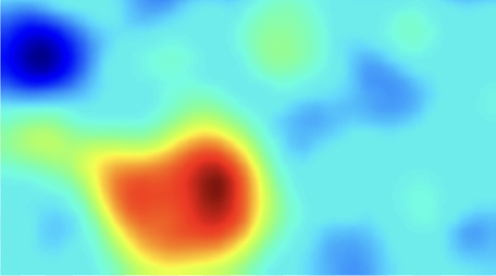

<head>
  <title> Intermediate Machine Learning </title>
  <link rel="stylesheet" href="theme/css/main.css" />
  <link rel="shortcut icon" type="image/x-icon" href="favicon.ico?">
</head>

Intermediate Machine Learning
===============================

S&DS 365 is a second course in machine learning at the advanced undergraduate or beginning graduate level. The course assumes familiarity with the basic ideas and techniques in machine learning, for example as covered in S&DS 265. The course treats methods together with mathematical frameworks that provide intuition and justifications for how and when the methods work. Assignments give students hands-on experience with machine learning techniques, to build the skills needed to adapt approaches to new problems. Topics include nonparametric regression and classification, kernel methods, risk bounds, nonparametric Bayesian approaches, attention and language models, generative models, sparsity and manifolds, and reinforcement learning. Programming is central to the course, and is based on the Python programming language and Jupyter notebooks.

As prerequisites, students are expected to have a background in probability and statistics, at the level of S&DS 242 (Theory of Statistics), familiarity with the core ideas from linear algebra, for example through Math 222 (Linear Algebra with Applications), and computational skills at the level of S&DS 265 (Introductory Machine Learning) or CPSC 200 (Introduction to Information Systems). Background material can be found at the
[Introductory Machine Learning](http://introml.ydata123.org) (S&DS 265) course site.

Computing for the course uses Python in Jupyter notebooks. These can be run using [Anaconda](https://www.anaconda.com/products/individual) with the [IML environment](https://raw.githubusercontent.com/YData123/sds365-fa22/main/env/IML_env.yml) that includes the packages we'll need <a href="https://raw.githubusercontent.com/YData123/sds365-fa22/main/env/IML_env.zip" download>(click here to download)</a>
; instructions for installing this environment are available on [Yale Canvas](https://canvas.yale.edu).  The notebooks can also be run in [Google Colab](https://colab.research.google.com) by clicking on the  icon.

Complementary readings refer to sections in the book [Probabilistic Machine Learning: An Introduction](https://probml.github.io/pml-book/book1.html), by Kevin Murphy, MIT Press, 2022 (forthcoming).

 

Calendar Fall 2022
---
Lectures: Monday/Wednesday 9:00-10:15am
 
[SSS 114](https://map.yale.edu/?id=1910#!m/563689?ct/52707)

Week | Dates |  Topics | Demos & Tutorials |  Lecture Slides | Readings & Notes | Assignments & Exams
----------- | ----------- | ------------- | ------------ | ------------- | ------------- | -----------
1 | Aug 31, Sep 2 |    Course overview |   [Python elements](https://github.com/YData123/sds265-fa21/raw/main/demos/python/python-elements.zip)      [Pandas and regression](https://github.com/YData123/sds265-fa21/raw/main/demos/covid-trends/covid-trends.zip)    [Lasso example](https://github.com/YData123/sds365-fa22/raw/main/demos/lasso/lasso-example.zip)  | Aug 31: [Course overview](https://github.com/YData123/sds365-fa22/raw/main/lectures/lecture-aug-31.pdf)   Sep 2: [Sparse regression](https://github.com/YData123/sds365-fa22/raw/main/lectures/lecture-sep-2.pdf) | PML Section 11.4  |
2 | Sep 7 | Smoothing and kernels |   [Smoothing example](https://github.com/YData123/sds365-fa22/raw/main/demos/smoothing/smoothing-demo.zip)    [Using different kernels](https://github.com/YData123/sds365-fa22/raw/main/demos/smoothing/smoothing-demo2.zip)  | Sep 7: [Smoothing](https://github.com/YData123/sds365-fa22/raw/main/lectures/lecture-sep-7.pdf) | PML Sections 16.3, 17.1 | Sep 7: [Quiz 1](https://yale.instructure.com/courses/79951/quizzes)
3 | Sep 12, 14 | Density estimation and risk bounds  |  [Mercer kernels](https://github.com/YData123/sds365-fa22/raw/main/demos/mercer_kernels/mercer-kernel-demo.zip)    [Density estimation demo](https://github.com/YData123/sds365-fa22/raw/main/demos/smoothing/smoothing-demo3.zip)  | Sep 12: [Mercer Kernels](https://github.com/YData123/sds365-fa22/raw/main/lectures/lecture-sep-12.pdf)   Sep 14: [Density estimation](https://github.com/YData123/sds365-fa22/raw/main/lectures/lecture-sep-14.pdf) |    [Notes on Mercer kernels](https://github.com/YData123/sds365-fa22/raw/main/notes/mercer-kernels.pdf)   [Bias-variance tradeoff for density estimation](https://github.com/YData123/sds365-fa22/raw/main/notes/kernel-bias-variance.pdf) |  Sep 14:  [Assn 1 out](https://github.com/YData123/sds365-fa22/raw/main/assignments/assn1/assn1.zip)
4 | Sep 19, 21 | Neural networks for classification | [TensorFlow playground](https://playground.tensorflow.org/)    [Convolution demo](https://github.com/YData123/sds365-fa22/raw/main/demos/convolution/convolve_demo.zip) <!--    [Problem 4 warmup](https://github.com/YData123/sds365-fa22/raw/main/demos/convolution/brain-food.zip) --> | Sep 19: [Neural networks](https://github.com/YData123/sds365-fa22/raw/main/lectures/lecture-sep-19.pdf)   Sep 21: [Convolutional neural networks](https://github.com/YData123/sds365-fa22/raw/main/lectures/lecture-sep-21.pdf) | PML Sections 13.1, 13.2   [Notes on backpropagation](https://github.com/YData123/sds265-fa21/raw/main/notes/backprop.pdf) | Sep 21: [Quiz 2](https://yale.instructure.com/courses/79951/quizzes)
5 | Sep 26, 28 | Nonparametric Bayes |  [Parametric Bayes](https://github.com/YData123/sds265-fa21/raw/main/demos/bayes/bayes.zip)     [Gaussian processes](https://github.com/YData123/sds365-fa22/raw/main/demos/gaussian_processes/gp_demo.zip) |  Sep 26: [Gaussian processes](https://github.com/YData123/sds365-fa22/raw/main/lectures/lecture-sep-26.pdf)   Sep 28: [Gaussian processes continued](https://github.com/YData123/sds365-fa22/raw/main/lectures/lecture-sep-28.pdf)  | PML Section 17.2   [Notes on Bayesian inference](https://github.com/YData123/sds265-fa21/raw/main/notes/bayes-notes.pdf)   [Notes on nonparametric Bayes](https://github.com/YData123/sds365-fa22/raw/main/notes/nonparametric-bayes.pdf) |  Sep 28: Assn 1 in;  [Assn 2 out](https://github.com/YData123/sds365-fa22/raw/main/assignments/assn2/assn2.zip)
6 | Oct 3, 5 | Gibbs sampling and approximate inference |  [Gibbs sampling](https://github.com/YData123/sds365-fa22/raw/main/demos/gibbs_sampling/dpm_gibbs.zip) | Oct 3: [Gibbs sampling](https://github.com/YData123/sds365-fa22/raw/main/lectures/lecture-oct-3.pdf)   Oct 5: [Introduction to approximate inference](https://github.com/YData123/sds365-fa22/raw/main/lectures/lecture-oct-5.pdf)  |  [Notes on Gibbs sampling](https://github.com/YData123/sds365-fa22/raw/main/notes/dpm_gibbs.pdf) | Oct 5: [Quiz 3](https://yale.instructure.com/courses/79951/quizzes)
7 | Oct 10, 12 | Variational inference |  [Variational autoencoders](https://github.com/YData123/sds365-fa22/raw/main/demos/variational/vae_demo.zip) |  Oct 10: [Variational inference and VAEs](https://github.com/YData123/sds365-fa22/raw/main/lectures/lecture-oct-10.pdf)   Oct 12: [VAEs and review](https://github.com/YData123/sds365-fa22/raw/main/lectures/lecture-oct-12.pdf)   | PML Section 20.3   [Notes on variational inference](https://github.com/YData123/sds365-fa22/raw/main/notes/variational.pdf)  | Oct 12: Assn 2 in     [Assn 3 out](https://github.com/YData123/sds365-fa22/raw/main/assignments/assn3/assn3.zip)
8 | Oct 17 | Midterm  | | | [Practice midterm](https://yale.instructure.com/courses/79951/files/folder/Midterm) | Oct 17: Midterm exam
9 | Oct 24, 26 | Graphs and structure learning |  [Graphical lasso demo](https://github.com/YData123/sds365-fa22/raw/main/demos/graphs/glasso_demo.zip)   [Graph neural networks](https://distill.pub/2021/understanding-gnns/) | Oct 24: [Sparsity and graphs](https://github.com/YData123/sds365-fa22/raw/main/lectures/lecture-oct-24.pdf)   Oct 26: [Discrete data and graph neural nets](https://github.com/YData123/sds365-fa22/raw/main/lectures/lecture-oct-26.pdf) |  [Notes on graphs and structure learning](https://github.com/YData123/sds365-fa22/raw/main/notes/graphs.pdf)   PML Section 23.4 |
10 | Oct 31, Nov 2 | Deep reinforcement learning |  [Q-learning demo](https://github.com/YData123/sds365-fa22/raw/main/demos/q_learning/qlearning_demo.zip) |  Oct 31: [Reinforcement learning](https://github.com/YData123/sds365-fa22/raw/main/lectures/lecture-oct-31.pdf)   Nov 2: [Deep reinforcement learning](https://github.com/YData123/sds365-fa22/raw/main/lectures/lecture-nov-2.pdf) | Sutton and Barto, Section 6.5 | Nov 2: Assn 3 in    [Assn 4 out](https://github.com/YData123/sds365-fa22/raw/main/assignments/assn4/assn4.zip)
11 | Nov 7, 9 | Policy gradient methods |   [DQN demo](https://github.com/YData123/sds365-fa22/raw/main/demos/dqn_demo/dqn_demo.zip)    [Policy gradients demo](https://github.com/YData123/sds365-fa22/raw/main/demos/policy_gradients_demo/policy_gradients_demo.zip)    [Actor-critic demo](https://github.com/YData123/sds365-fa22/raw/main/demos/actor_critic/actor_critic_demo.zip) | Nov 7: [Policy gradient methods](https://github.com/YData123/sds365-fa22/raw/main/lectures/lecture-nov-7.pdf)   Nov 9: [Actor-critic methods](https://github.com/YData123/sds365-fa22/raw/main/lectures/lecture-nov-9.pdf) | Sutton and Barto, Section 13.1-13.3, 13.5 | Nov 9: Quiz 4 
12 | Nov 14, 16 | Sequential and sequence-to-sequence  models |  [RNN demo: Fakespeare](https://github.com/YData123/sds365-fa22/raw/main/demos/rnn_demo/rnn-demo.zip)   [TensorFlow: Text generation](https://www.tensorflow.org/text/tutorials/text_generation)  | Nov 14: [HMMs and RNNs](https://github.com/YData123/sds365-fa22/raw/main/lectures/lecture-nov-14.pdf)   Nov 16: [RNNs, GRUs, LSTMs, and all that](https://github.com/YData123/sds365-fa22/raw/main/lectures/lecture-nov-16.pdf)| PML Chapter 15 | Nov 16: Assn 4 in    [Assn 5 out](https://github.com/YData123/sds365-fa22/raw/main/assignments/assn5/assn5.zip)
13 | Nov 21, 23 | No class, Thanksgiving break | <!----> |  |
14 | Nov 28, 30 | Attention and language models |   [GPT-3 demo](https://github.com/YData123/sds365-fa22/raw/main/demos/gpt-3/hello_gpt3.zip)    [Codex demo](https://github.com/YData123/sds365-fa22/raw/main/demos/gpt-3/hello_codex.zip) |  Nov 28: [Sequence-to-sequence models](https://github.com/YData123/sds365-fa22/raw/main/lectures/lecture-nov-28.pdf)   Nov 30: [Attention](https://github.com/YData123/sds365-fa22/raw/main/lectures/lecture-nov-30.pdf) | PML Sections 15.4, 15.5 | Nov 30: [Quiz 5](https://yale.instructure.com/courses/79951/quizzes)
15 | Dec 5, 7 | Transformers   Societal issues |   [Transformer demo](https://github.com/YData123/sds365-fa22/raw/main/demos/tfer/tfer_demo.zip) |  Dec 5: [Attention and transformers](https://github.com/YData123/sds365-fa22/raw/main/lectures/lecture-dec-5.pdf)   Dec 7: [AI ethics and wrap up](https://github.com/YData123/sds365-fa22/raw/main/lectures/lecture-dec-7.pdf) | | Dec 7: Assn 5 in
   | Tue Dec 20, 7pm  | Final exam | | | | [Practice final](https://yale.instructure.com/courses/79951/files/folder/Final)   [Registrar: final exam schedule](http://catalog.yale.edu/ycps/final-examination-schedules/)

