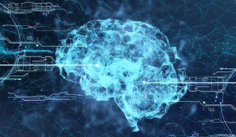

<head>
  <title> Introductory Machine Learning </title>
  <link rel="stylesheet" href="theme/css/main.css" />
  <link rel="shortcut icon" type="image/x-icon" href="favicon.ico?">
</head>

Introductory Machine Learning
====

S&DS 265 introduces some of the key ideas and techniques in machine learning. Algorithms and concepts are presented to build intuition for how different methods work, without advanced mathematics. Assignments give students hands-on experience with the methods on different types of data. Topics include linear regression and classification, tree-based methods, topic models, language models, word embeddings, two-layer and recurrent neural networks, reinforcement learning, and an introduction to deep learning. Examples come from a variety of sources including political speeches, archives of scientific articles, real estate listings, and natural images. Programming is central to the course, and is based on the Python programming language.

Computing for the course uses Python in Jupyter notebooks. These can be run using [Anaconda](https://www.anaconda.com/products/individual) with the [iML environment](https://raw.githubusercontent.com/YData123/sds265-fa22/master/env/iml_env.yml) adopted by the course <a href="https://raw.githubusercontent.com/YData123/sds265-fa22/master/env/iml_env.zip" download>(click here to download)</a>
; instructions for installing this environment are available on [Yale Canvas](https://canvas.yale.edu).  The notebooks can also be run in [Google Colab](https://colab.research.google.com) by clicking on the  icon.

 

Calendar Fall 2022
---
Lectures: Tuesday/Thursday 9:00-10:15am
 
[Davies Auditorium](https://map.yale.edu/?id=1910#!m/563685?ct/52707)

Complementary readings marked ISL refer to sections in the book [An Introduction to Statistical Learning](https://www.statlearning.com/) (second edition). This text uses the R language, but the treatment of concepts is at an appropriate level for iML.
 

<!-- #### Davies auditorium is not available after Tuesday's flooding. Class on Thursday, September 8, will be in SSS 114. -->

 Week | Dates |  Topics | Demos & Tutorials | Lecture Slides | Readings and Notes | Assignments & Exams 
----------- | ----------- | ------------- | ------------ | ------------- | ----------- | ------------
1 | Sept 1  |     Course overview | | Sept 1: [Course overview](https://github.com/YData123/sds265-fa22/raw/master/lectures/lecture-sept-01.pdf) |
2 | Sept 6, 8 |    Python and background concepts |   [Python elements](https://github.com/YData123/sds265-fa22/raw/master/demos/python/python-elements.zip)      [Covid trends](https://github.com/YData123/sds265-fa22/raw/master/demos/covid-trends/covid-trends.zip)   | Sept 6: [Python elements](https://github.com/YData123/sds265-fa22/raw/master/lectures/lecture-sept-06.pdf)   Sept 8: [Pandas and linear regression](https://github.com/YData123/sds265-fa22/raw/master/lectures/lecture-sept-08.pdf) | [Data8 Chapters 3](https://www.inferentialthinking.com/chapters/03/programming-in-python.html), [4](https://www.inferentialthinking.com/chapters/04/Data_Types.html), [5](https://www.inferentialthinking.com/chapters/05/Sequences.html) | Thu: [Quiz 1](https://yale.instructure.com/courses/79950/quizzes) | 
3 | Sept 13, 15 | Linear regression and classification |  [Covid trends (revisited)](https://github.com/YData123/sds265-fa22/raw/master/demos/covid-trends/covid-trends-revisited.zip)     [Classification examples](https://github.com/YData123/sds265-fa22/raw/master/demos/classification/classification.zip)  |  Sept 13: [Regression concepts](https://github.com/YData123/sds265-fa22/raw/master/lectures/lecture-sept-13.pdf)    Sept 15: [Classification](https://github.com/YData123/sds265-fa22/raw/master/lectures/lecture-sept-15.pdf) | ISL Sections 3.1, 3.2, 3.5   Notes on [regression](https://github.com/YData123/sds265-fa22/raw/master/notes/linear_regression.pdf)   ISL Sections 4.3, 4.4   [Notes on classification](https://github.com/YData123/sds265-fa22/raw/master/notes/linear_classification.pdf) |  Thu:  [Assn 1](https://github.com/YData123/sds265-fa22/raw/master/assignments/assn1/assn1.zip)  
4 | Sept 20, 22 | Stochastic gradient descent |  [SGD examples](https://github.com/YData123/sds265-fa22/raw/master/demos/sgd/sgd.zip)  |  Sept 20: [Classification (continued)](https://github.com/YData123/sds265-fa22/raw/master/lectures/lecture-sept-20.pdf)   Sept 22: [Stochastic gradient descent](https://github.com/YData123/sds265-fa22/raw/master/lectures/lecture-sept-22.pdf) | ISL Section 6.2.2   ISL Section 10.7.2 | Thu: [Quiz 2](https://yale.instructure.com/courses/79950/quizzes)    | 
5 | Sept 27, 29 | Bias and variance, cross-validation |   [Bias-variance tradeoff](https://github.com/YData123/sds265-fa22/raw/master/demos/bias-variance/bias-variance.zip)     [Covid trends (revisited)](https://github.com/YData123/sds265-fa22/raw/master/demos/covid-trends-bias-variance/covid-trends-bias-variance.zip)    [California housing](https://github.com/YData123/sds265-fa22/raw/master/demos/cross-validation/california-housing.zip) | Sept 27: [Bias and variance](https://github.com/YData123/sds265-fa22/raw/master/lectures/lecture-sept-27.pdf)   Sept 29: [Cross-validation](https://github.com/YData123/sds265-fa22/raw/master/lectures/lecture-sept-29.pdf) | ISL Section 2.2   ISL Section 5.1 | Thu: Assn 1 in    [Assn 2 out](https://github.com/YData123/sds265-fa22/raw/master/assignments/assn2/assn2.zip) |
6 | Oct 4, 6 | Tree-based methods |  [Trees and forests](https://github.com/YData123/sds265-fa22/raw/master/demos/trees/trees.zip)    [Visualizing trees](http://www.r2d3.us/visual-intro-to-machine-learning-part-1/)    [Bagging operations](https://github.com/YData123/sds265-fa22/raw/master/demos/trees/bagging.zip) |   Oct 4: [Trees](https://github.com/YData123/sds265-fa22/raw/master/lectures/lecture-oct-4.pdf)   Oct 6: [Forests](https://github.com/YData123/sds265-fa22/raw/master/lectures/lecture-oct-6.pdf) | ISL Sections 8.1, 8.2 | Thu: [Quiz 3](https://yale.instructure.com/courses/79950/quizzes)    |
7 | Oct 11, 13 | PCA and dimension reduction |  [PCA examples](https://github.com/YData123/sds265-fa22/raw/master/demos/pca/pca.zip)    [PCA revisited](https://github.com/YData123/sds265-fa22/raw/master/demos/pca/pca-demo-redux.zip)    [Used for regression](https://github.com/YData123/sds265-fa22/raw/master/demos/pca/iris-pca.zip)  | Oct 11: [PCA](https://github.com/YData123/sds265-fa22/raw/master/lectures/lecture-oct-11.pdf)   Oct 13: [PCA and review](https://github.com/YData123/sds265-fa22/raw/master/lectures/lecture-oct-13.pdf) | ISL Section 12.2 |  Thu: Assn 2 in    [Assn 3 out](https://github.com/YData123/sds265-fa22/raw/master/assignments/assn3/assn3.zip) 
8 | Oct 18  |  Midterm exam (in class) |  |   | On Canvas:   [Practice midterms](https://yale.instructure.com/courses/79950/files/folder/practice_midterms) / [Sample solns](https://yale.instructure.com/courses/79950/files/folder/practice_midterms/)   [Midterm](https://yale.instructure.com/courses/79950/files/folder/midterm/) / [Sample soln](https://yale.instructure.com/courses/79950/files/folder/midterm/)
9 | Oct 25, 27 | Language models, word embeddings |  [GPT-3 demo](https://github.com/YData123/sds265-fa22/raw/master/demos/language-models/hello_gpt3.zip)    [Word embeddings](https://github.com/YData123/sds265-fa22/raw/master/demos/embeddings/embeddings.zip) |  Oct 25: [Language models](https://github.com/YData123/sds265-fa22/raw/master/lectures/lecture-oct-25.pdf)   Oct 27: [Word embeddings](https://github.com/YData123/sds265-fa22/raw/master/lectures/lecture-oct-27.pdf) | [OpenAI: Better language models](https://openai.com/blog/better-language-models/) (GPT-2) |   [Assn 4 out](https://github.com/YData123/sds265-fa22/raw/master/assignments/assn4/assn4.zip) 
10 | Nov 1, 3 | Bayesian inference, topic models |  [Mixtures](https://github.com/YData123/sds265-fa22/raw/master/demos/bayes/mix.zip)    [Bayesian inference](https://github.com/YData123/sds265-fa22/raw/master/demos/bayes/bayes.zip)    [Topic models](https://github.com/YData123/sds265-fa22/raw/master/demos/topic-models/topic-models.zip)  |    Nov 1: [Bayesian inference](https://github.com/YData123/sds265-fa22/raw/master/lectures/lecture-nov-1.pdf)   Nov 3: [Bayes and topic models](https://github.com/YData123/sds265-fa22/raw/master/lectures/lecture-nov-3.pdf) | [Notes on Bayesian inference](https://github.com/YData123/sds265-fa22/raw/master/notes/bayes-notes.pdf) <!--  [Notes on simulation](https://github.com/YData123/sds265-fa22/raw/master/notes/simulation.pdf)--> | Tue: Assn 3 in   Thu: [Quiz 4](https://yale.instructure.com/courses/79950/quizzes)
11 | Nov 8, 10 | Introduction to neural networks |  [Minimal neural network](https://github.com/YData123/sds265-fa22/raw/master/demos/neural-nets/neural-nets.zip)    [Regression examples](https://github.com/YData123/sds265-fa22/raw/master/demos/neural-nets/neural-nets-regress.zip)  |    Nov 8: [Topic models](https://github.com/YData123/sds265-fa22/raw/master/lectures/lecture-nov-8.pdf)   Nov 10: [Neural networks](https://github.com/YData123/sds265-fa22/raw/master/lectures/lecture-nov-10.pdf) | ISL Sections 10.1, 10.2 | Thu: Assn 4 in    [Assn 5 out](https://github.com/YData123/sds265-fa22/raw/master/assignments/assn5/assn5.zip) 
12 | Nov 15, 17 | Deep neural networks | [Tensorflow playground](https://playground.tensorflow.org/)    [Autoencoder examples](https://github.com/YData123/sds265-fa22/raw/master/demos/deep-nets/deep-nets.zip)  |   Nov 15: [Neural networks (continued)](https://github.com/YData123/sds265-fa22/raw/master/lectures/lecture-nov-16.pdf)  Nov 17: [Autoencoders](https://github.com/YData123/sds265-fa22/raw/master/lectures/lecture-nov-18.pdf) | ISL Section 10.7   [Notes on backpropagation](https://github.com/YData123/sds265-fa22/raw/master/notes/backprop.pdf) | Thu: [Quiz 5]()
13 | Nov 22, 24 | No class, Thanksgiving break | <!----> |  |
14 | Nov 29, Dec 1 | Reinforcement learning |  [Q-learning](https://github.com/YData123/sds265-fa22/raw/master/demos/reinforcement-learning/reinforcement-learning.zip) |  Nov 29: [Reinforcement learning](https://github.com/YData123/sds265-fa22/raw/master/lectures/lecture-nov-30.pdf)   Dec 1: [Deep reinforcement learning](https://github.com/YData123/sds265-fa22/raw/master/lectures/lecture-dec-02.pdf) | | Thu: Assn 5 in    [Assn 6 out](https://github.com/YData123/sds265-fa22/raw/master/assignments/assn7/assn7.zip) 
15 | Dec 6, 8 | Societal issues for machine learning  | |  Dec 6: [Societal issues](https://github.com/YData123/sds265-fa22/raw/master/lectures/lecture-dec-07.pdf)   Dec 8: [Course wrap up](https://github.com/YData123/sds265-fa22/raw/master/lectures/lecture-dec-09.pdf) | | <!---->  Thu: [Quiz 6]()
16 | Dec 15  | | | | | Thu: Assn 6 in 
17 | Mon, Dec 19, 7pm, Davies Aud    | Final exam  | | | [Registrar: Final exam schedule](https://registrar.yale.edu/general-information/final-exams/)   [Practice finals](https://yale.instructure.com/courses/79950/files/folder/practice_finals/)
