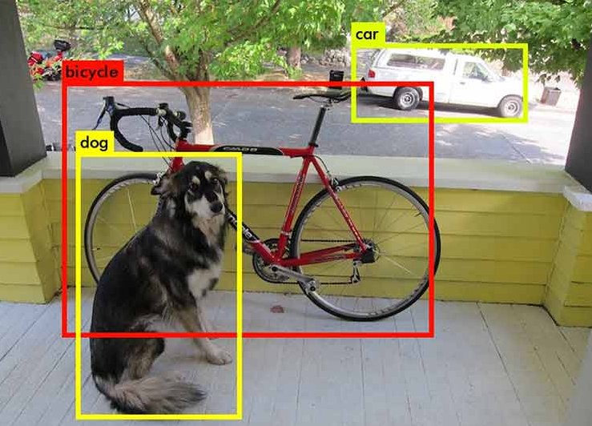

<head>
  <title> Intermediate Machine Learning </title>
  <link rel="stylesheet" href="theme/css/main.css" />
  <link rel="shortcut icon" type="image/x-icon" href="favicon.ico?">
</head>

<!--
DALL-E's description of its work: 
A black and white image of a Rube Goldberg machine, 
intricately designed to take on the form of a human brain. 
The mechanical elements are arranged to emulate 
the brain's hemispheres and neural pathways.
-->
 

Intermediate Machine Learning
===============================

S&DS 365 is a second course in machine learning at the advanced undergraduate or beginning graduate level. The course assumes familiarity with the basic ideas and techniques in machine learning, for example as covered in S&DS 265. The course treats methods together with mathematical frameworks that provide intuition and justifications for how and when the methods work. Assignments give students hands-on experience with machine learning techniques, to build the skills needed to adapt approaches to new problems. Topics include nonparametric regression and classification, kernel methods, risk bounds, nonparametric Bayesian approaches, attention and language models, generative models, sparsity and manifolds, and reinforcement learning. Programming is central to the course, and is based on the Python programming language and Jupyter notebooks.

As prerequisites, students are expected to have a background in probability and statistics, at the level of S&DS 242 (Theory of Statistics), familiarity with the core ideas from linear algebra, for example through Math 222 (Linear Algebra with Applications), and computational skills at the level of S&DS 265 (Introductory Machine Learning) or CPSC 200 (Introduction to Information Systems). Background material can be found at the
[Introductory Machine Learning](http://introml.ydata123.org) (S&DS 265) course site.

Computing for the course uses Python in Jupyter notebooks. These can be run using [Anaconda](https://www.anaconda.com/products/individual) with the [IML environment](https://raw.githubusercontent.com/YData123/sds365-fa22/main/env/IML_env.yml) that includes the packages needed <a href="https://raw.githubusercontent.com/YData123/sds365-fa22/main/env/IML_env.zip" download>(click here to download)</a>
; instructions for installing this environment are available on [Yale Canvas](https://canvas.yale.edu).  The notebooks can also be run in [Google Colab](https://colab.research.google.com) by clicking on the  icon.

Complementary readings refer to sections in the book [Probabilistic Machine Learning: An Introduction](https://probml.github.io/pml-book/book1.html), by Kevin Murphy, MIT Press, 2022. Part I "Foundations" gives a good treatment of background in probability, statistics, and linear algebra that is useful for this course. (But this part of the book also covers much more than we need.)

Assignments and quizzes are posted and due on Wednesday in a given week.

 

Calendar Fall 2024
---
Lectures: Monday/Wednesday 1:00-2:15pm
 
[WLH 201 - William L. Harkness Hall 201](https://map.yale.edu/?id=1910#!m/560127?s)

Week | Dates |  Topics | Demos & Tutorials |  Lecture Slides | Readings & Notes | Assignments & Exams
----------- | ----------- | ------------- | ------------ | ------------- | ------------- | -----------
1 | Aug 28, Aug 30 |    Sparse regression |   [Python elements](https://github.com/YData123/sds265-fa21/raw/main/demos/python/python-elements.zip)      [Pandas and regression](https://github.com/YData123/sds265-fa22/raw/master/demos/covid-trends/covid-trends.zip)    [Lasso example](https://github.com/YData123/sds365-fa22/raw/main/demos/lasso/lasso-example.zip)  | Wed: [Course overview](https://github.com/YData123/sds365-fa24/raw/main/lectures/lecture-aug-28.pdf)   Fri: [Sparse regression](https://github.com/YData123/sds365-fa24/raw/main/lectures/lecture-aug-30.pdf) | PML Section 11.4   [Notes on linear regression](https://github.com/YData123/sds365-fa24/raw/main/notes/linear_regression.pdf) |
2 | Sep 4 | Smoothing and kernels |   [Smoothing example](https://github.com/YData123/sds365-fa22/raw/main/demos/smoothing/smoothing-demo.zip)    [Using different kernels](https://github.com/YData123/sds365-fa22/raw/main/demos/smoothing/smoothing-demo2.zip)  | Wed: [Smoothing](https://github.com/YData123/sds365-fa24/raw/main/lectures/lecture-sep-4.pdf) | PML Sections 16.3, 17.1   [Notes on computing the lasso](https://github.com/YData123/sds365-fa24/raw/main/notes/lasso.pdf)| [Quiz 1](https://yale.instructure.com/courses/98751/quizzes)
3 | Sep 9, 11 | Density estimation and Mercer kernels |   [Density estimation demo](https://github.com/YData123/sds365-fa22/raw/main/demos/smoothing/smoothing-demo3.zip)    [Mercer kernels (1/3)](https://github.com/YData123/sds365-fa22/raw/main/demos/mercer_kernels/mercer-kernel-demo2.zip)    [Mercer kernels (2/3)](https://github.com/YData123/sds365-fa24/raw/main/demos/mercer_kernels/mercer-kernel-demo.zip)    [Mercer kernels (3/3)](https://github.com/YData123/sds365-fa24/raw/main/demos/mercer_kernels/mercer-kernel-fit-demo.zip) | Mon: [Smoothing and density estimation](https://github.com/YData123/sds365-fa24/raw/main/lectures/lecture-sep-9.pdf)   Wed: [Mercer kernels](https://github.com/YData123/sds365-fa24/raw/main/lectures/lecture-sep-11.pdf) |  [Risk bounds for local smoothing](https://github.com/YData123/sds365-fa24/raw/main/notes/kernel-bias-variance.pdf)    [Notes on Mercer kernels](https://github.com/YData123/sds365-fa24/raw/main/notes/mercer-kernels.pdf) |   [Assn 1 out](https://github.com/YData123/sds365-fa24/raw/main/assignments/assn1/assn1.zip)
4 | Sep 16, 18 | Neural networks and overparameterized models |  [np-complete example (1/2)](https://github.com/YData123/sds265-fa21/raw/main/demos/neural-nets/neural-nets-regress.zip)     [np-complete example (2/2)](https://github.com/YData123/sds265-fa21/raw/main/demos/neural-nets/neural-nets.zip)    [TensorFlow playground](https://playground.tensorflow.org/) | Mon: [Neural networks](https://github.com/YData123/sds365-fa24/raw/main/lectures/lecture-sep-16.pdf)   Wed: [Double descent](https://github.com/YData123/sds365-fa24/raw/main/lectures/lecture-sep-18.pdf)  | PML Sections 13.1, 13.2   [Notes on backpropagation](https://github.com/YData123/sds265-fa21/raw/main/notes/backprop.pdf)   [Notes on double descent](https://github.com/YData123/sds365-fa24/raw/main/notes/double-descent.pdf) | [Quiz 2](https://yale.instructure.com/courses/98751/quizzes)
5 | Sep 23, 25 | Convolutional neural networks |  [Convolution demo](https://github.com/YData123/sds365-fa22/raw/main/demos/convolution/convolve_demo.zip)    [CNN demo (1/2)](https://github.com/YData123/sds365-fa22/raw/main/demos/convolution/cnn_mnist_demo.zip)    [CNN demo (2/2)](https://github.com/YData123/sds365-fa24/raw/main/demos/convolution/brain_food.zip) |  Mon: [Convolutional neural networks](https://github.com/YData123/sds365-fa24/raw/main/lectures/lecture-sep-23.pdf)   Wed: [CNNs and Gaussian Processes](https://github.com/YData123/sds365-fa24/raw/main/lectures/lecture-sep-25.pdf)  | PML Section 17.2   [Notes on Bayesian inference](https://github.com/YData123/sds365-fa24/raw/main/notes/bayes-notes.pdf)   [Notes on nonparametric Bayes](https://github.com/YData123/sds365-fa24/raw/main/notes/nonparametric-bayes.pdf) |  Assn 1 in    [Assn 2 out](https://github.com/YData123/sds365-fa24/raw/main/assignments/assn2/assn2.zip) 
6 | Sept 30, Oct 2 | Gaussian processes and approximate inference |  [Parametric Bayes](https://github.com/YData123/sds265-fa21/raw/main/demos/bayes/bayes.zip)     [Gaussian processes](https://github.com/YData123/sds365-fa24/raw/main/demos/gaussian_processes/gp_demo.zip)    [Gibbs sampling for image denoising](https://github.com/YData123/sds365-fa22/raw/main/demos/gibbs_sampling/gibbs_denoise.zip)  | Mon: [Gaussian processes](https://github.com/YData123/sds365-fa24/raw/main/lectures/lecture-sep-30.pdf)   Wed: [Introduction to approximate inference](https://github.com/YData123/sds365-fa24/raw/main/lectures/lecture-oct-2.pdf)  |  [Notes on simulation](https://github.com/YData123/sds365-fa24/raw/main/notes/simulation.pdf) | [Quiz 3](https://yale.instructure.com/courses/98751/quizzes)
7 | Oct 7, 9 | Variational inference |  [Variational autoencoders](https://github.com/YData123/sds365-fa22/raw/main/demos/variational/vae_demo.zip) |  Mon: [Variational inference](https://github.com/YData123/sds365-fa24/raw/main/lectures/lecture-oct-7.pdf)   Wed: [VAEs](https://github.com/YData123/sds365-fa24/raw/main/lectures/lecture-oct-9.pdf)   | PML Section 20.3   [Notes on variational inference](https://github.com/YData123/sds365-fa24/raw/main/notes/variational.pdf)  | Assn 2 in     [Assn 3 out](https://github.com/YData123/sds365-fa24/raw/main/assignments/assn3/assn3.zip)
8 | Oct 14 | Midterm  | | | [Practice midterms](https://yale.instructure.com/courses/98751/files/folder/Midterm/practice) | Oct 14: Midterm exam
9 | Oct 21, 23 | Graphs and structure learning |  [Graphical lasso demo](https://github.com/YData123/sds365-fa22/raw/main/demos/graphs/glasso_demo.zip) | Mon: [Sparsity and graphs](https://github.com/YData123/sds365-fa24/raw/main/lectures/lecture-oct-21.pdf)   Wed: [Discrete data and graph neural nets](https://github.com/YData123/sds365-fa24/raw/main/lectures/lecture-oct-23.pdf) |  [Notes on graphs and structure learning](https://github.com/YData123/sds365-fa24/raw/main/notes/graphs.pdf)    [Graph neural networks](https://distill.pub/2021/understanding-gnns/)   PML Section 23.4 |
10 | Oct 28, Oct 30 | Deep reinforcement learning |  [Q-learning demo](https://github.com/YData123/sds365-fa22/raw/main/demos/q_learning/qlearning_demo.zip)    [DQN demo](https://github.com/YData123/sds365-fa22/raw/main/demos/dqn_demo/dqn_demo.zip) |  Mon: [Reinforcement learning](https://github.com/YData123/sds365-fa24/raw/main/lectures/lecture-oct-28.pdf)   Wed: [Deep reinforcement learning](https://github.com/YData123/sds365-fa24/raw/main/lectures/lecture-oct-30.pdf) | Sutton and Barto, Section 6.5 | Nov 4: Assn 3 in    [Assn 4 out](https://github.com/YData123/sds365-fa24/raw/main/assignments/assn4/assn4.zip)
11 | Nov 4, 6 | Policy gradient methods |   [Policy gradients demo](https://github.com/YData123/sds365-fa24/raw/main/demos/policy_gradients_demo/policy_gradients_demo.zip)    [Actor-critic demo](https://github.com/YData123/sds365-fa24/raw/main/demos/actor_critic/actor_critic_demo.zip) | Mon: [Policy gradient methods](https://github.com/YData123/sds365-fa24/raw/main/lectures/lecture-nov-4.pdf)   Wed: [Actor-critic methods](https://github.com/YData123/sds365-fa24/raw/main/lectures/lecture-nov-6.pdf) | Sutton and Barto, Section 13.1-13.3, 13.5 | [Quiz 4](https://yale.instructure.com/courses/98751/quizzes) 
12 | Nov 11, 13 | Sequential models |  [vanilla RNN](https://github.com/YData123/sds365-fa22/raw/main/demos/rnn_demo/rnn-demo.zip)    [Fakespeare GRU](https://github.com/YData123/sds365-fa22/raw/main/demos/gru_demo/julius_tensor.zip)  | Mon: [HMMs and RNNs](https://github.com/YData123/sds365-fa24/raw/main/lectures/lecture-nov-13.pdf)   Wed: [RNNs, GRUs, LSTMs, and all that](https://github.com/YData123/sds365-fa24/raw/main/lectures/lecture-nov-15.pdf)| [TensorFlow: Text generation](https://www.tensorflow.org/text/tutorials/text_generation)   [Notes on HMMs and Kalman filters](https://github.com/YData123/sds365-fa24/raw/main/notes/hmm-kalman.pdf)   PML Chapter 15 | Assn 4 in    [Assn 5 out](https://github.com/YData123/sds365-fa24/raw/main/assignments/assn5/assn5.zip)
13 | Nov 18, 20 | Sequence-to-sequence models and Transformers |   [GPT-4 Python API](https://github.com/YData123/sds365-fa24/raw/main/demos/gpt-4/hello_gpt4.zip) <!--   [Codex demo](https://github.com/YData123/sds365-fa22/raw/main/demos/gpt-3/hello_codex.zip)--> |  Mon: [Sequence-to-sequence models](https://github.com/YData123/sds365-fa24/raw/main/lectures/lecture-nov-27.pdf)   Wed: [Attention and transformers](https://github.com/YData123/sds365-fa24/raw/main/lectures/lecture-nov-29.pdf) | [Notes on mixtures](https://github.com/YData123/sds365-fa24/raw/main/notes/mixtures.pdf)   PML Sections 15.4, 15.5 | [Quiz 5](https://yale.instructure.com/courses/98751/quizzes)
14 | Nov 25, 27 | No class, Thanksgiving break | <!----> |  |
15 | Dec 2, 4 | Transformers   Societal issues |   [Transformer demo](https://github.com/YData123/sds365-fa22/raw/main/demos/transformer/hand2hand_transformer.zip)   [Minimal LLM decoder](https://github.com/karpathy/llama2.c/blob/master/README.md)|  Mon: [Transformers, LLMs, and AI safety](https://github.com/YData123/sds365-fa24/raw/main/lectures/lecture-dec-4.pdf)   Wed: [Course wrap up](https://github.com/YData123/sds365-fa24/raw/main/lectures/lecture-dec-6.pdf) | | Assn 5 in
17  | December 15, 2pm | Final exam | | | [Practice exams](https://yale.instructure.com/courses/98751/files/folder/Final) |  [Registrar: final exam schedule](https://registrar.yale.edu/general-information/final-exams/) |

