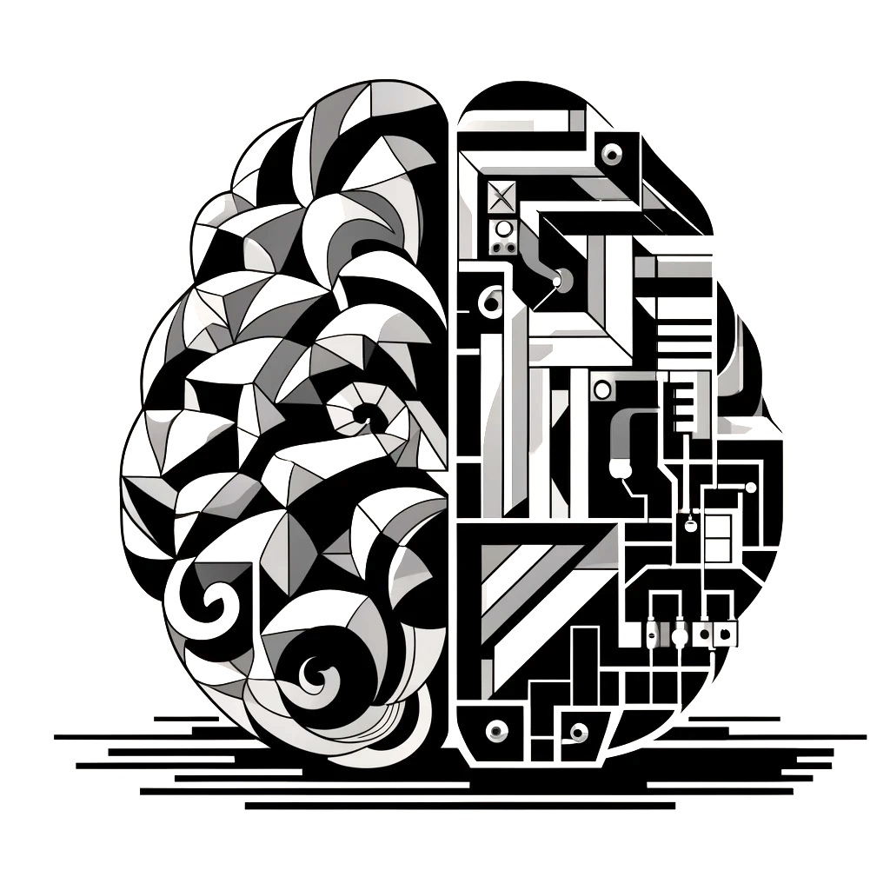

<head>
  <title> Introductory Machine Learning </title>
  <link rel="stylesheet" href="theme/css/main.css" />
  <link rel="shortcut icon" type="image/x-icon" href="favicon.ico?">
</head>

<small>
DALL-E's description of its work: 
A black and white 2-dimensional Cubist drawing that abstractly portrays a computer and a brain. 
It blends technological and intellectual elements in a striking monochromatic composition.
</small>
 
 

Introductory Machine Learning
====

S&DS 265 introduces some of the key ideas and techniques in machine learning. Algorithms and concepts are presented to build intuition for how different methods work, without advanced mathematics. Assignments give students hands-on experience with the methods on different types of data. Topics include linear regression and classification, tree-based methods, topic models, language models, word embeddings, two-layer and recurrent neural networks, reinforcement learning, and an introduction to deep learning. Examples come from a variety of sources including political speeches, archives of scientific articles, real estate listings, and natural images. Programming is central to the course, and is based on the Python programming language.

Computing for the course uses Python in Jupyter notebooks. These can be run using [Anaconda](https://www.anaconda.com/products/individual) with the [iML environment](https://raw.githubusercontent.com/YData123/sds265-fa22/master/env/iml_env.yml) adopted by the course <a href="https://raw.githubusercontent.com/YData123/sds265-fa22/master/env/iml_env.zip" download>(click here to download)</a>
; instructions for installing this environment are available on [Yale Canvas](https://canvas.yale.edu).  The notebooks can also be run in [Google Colab](https://colab.research.google.com) by clicking on the  icon.

 

Calendar Fall 2024
---
Lectures: Tuesday/Thursday 11:35-12:50pm
 
[Davies Auditorium](https://map.yale.edu/?id=1910#!m/563685?ct/52707)

Complementary readings marked ISL refer to sections in the book [An Introduction to Statistical Learning](https://hastie.su.domains/ISLP/ISLP_website.pdf) (Python version, July 2023). Assignments and quizzes are posted and due on Thursday in a given week.
 

<!--Sunday, December 4: Canvas is currently down, across courses.  -->

 Week | Dates |  Topics | Demos & Tutorials | Lecture Slides | Readings and Notes | Assignments & Exams 
----------- | ----------- | ------------- | ------------ | ------------- | ----------- | ------------
1 | Aug 29  |     Course overview | | Thu: [Course overview](https://github.com/YData123/sds265-fa24/raw/main/lectures/lecture-aug-29.pdf) |
2 | Sept 3, 5 |    Python and background concepts |   [Python elements](https://github.com/YData123/sds265-fa23/raw/main/demos/python/python-elements.zip)      [Covid trends](https://github.com/YData123/sds265-fa22/raw/master/demos/covid-trends/covid-trends.zip)   | Tue: [Python elements](https://github.com/YData123/sds265-fa24/raw/main/lectures/lecture-sept-5.pdf)   Thu: [Pandas and linear regression](https://github.com/YData123/sds265-fa23/raw/main/lectures/lecture-sept-7.pdf) | [Data8 Chapters 3](https://www.inferentialthinking.com/chapters/03/programming-in-python.html), [4](https://www.inferentialthinking.com/chapters/04/Data_Types.html), [5](https://www.inferentialthinking.com/chapters/05/Sequences.html) | [Quiz 1](https://yale.instructure.com/courses/98741/quizzes)    [Assn 1 out](https://github.com/YData123/sds265-fa24/raw/main/assignments/assn1/assn1.zip)  | 
3 | Sept 10, 12 | Linear regression and classification |  [Covid trends (revisited)](https://github.com/YData123/sds265-fa23/raw/main/demos/covid-trends/covid-trends-revisited.zip)     [Classification examples](https://github.com/YData123/sds265-fa23/raw/main/demos/classification/classification.zip)  |  Tue: [Regression concepts](https://github.com/YData123/sds265-fa24/raw/main/lectures/lecture-sept-12.pdf)    Thu: [Classification](https://github.com/YData123/sds265-fa24/raw/main/lectures/lecture-sept-14.pdf) | ISL Sections 3.1, 3.2, 3.5   Notes on [regression](https://github.com/YData123/sds265-fa22/raw/master/notes/linear_regression.pdf)   ISL Sections 4.3, 4.4   [Notes on classification](https://github.com/YData123/sds265-fa22/raw/master/notes/linear_classification.pdf) |  
4 | Sept 17, 19 | Stochastic gradient descent |  [SGD examples](https://github.com/YData123/sds265-fa22/raw/master/demos/sgd/sgd.zip)  |  Tue: [Classification (continued)](https://github.com/YData123/sds265-fa24/raw/main/lectures/lecture-sept-19.pdf)   Thu: [Stochastic gradient descent](https://github.com/YData123/sds265-fa24/raw/main/lectures/lecture-sept-21.pdf) | ISL Section 6.2.2   ISL Section 10.7.2 | Assn 1 in    [Assn 2 out](https://github.com/YData123/sds265-fa24/raw/main/assignments/assn2/assn2.zip)    | 
5 | Sept 24, 26 | Bias and variance, cross-validation |   [Bias-variance tradeoff](https://github.com/YData123/sds265-fa22/raw/master/demos/bias-variance/bias-variance.zip)     [Covid trends (revisited)](https://github.com/YData123/sds265-fa22/raw/master/demos/covid-trends-bias-variance/covid-trends-bias-variance.zip)    [California housing](https://github.com/YData123/sds265-fa22/raw/master/demos/cross-validation/california-housing.zip) | Tue: [Bias and variance](https://github.com/YData123/sds265-fa24/raw/main/lectures/lecture-sept-26.pdf)   Thu: [Cross-validation](https://github.com/YData123/sds265-fa24/raw/main/lectures/lecture-sept-28.pdf) | ISL Section 2.2   ISL Section 5.1 | [Quiz 2](https://yale.instructure.com/courses/98741/quizzes)  |
6 | Oct 1, 3 | Tree-based methods and   principal components |  [Trees and forests](https://github.com/YData123/sds265-fa22/raw/master/demos/trees/trees.zip)    [Visualizing trees](http://www.r2d3.us/visual-intro-to-machine-learning-part-1/)    [PCA examples](https://github.com/YData123/sds265-fa22/raw/master/demos/pca/pca.zip) |   Tue: [Trees and Forests](https://github.com/YData123/sds265-fa24/raw/main/lectures/lecture-oct-3.pdf)   Thu: [PCA](https://github.com/YData123/sds265-fa24/raw/main/lectures/lecture-oct-5.pdf) | ISL Sections 8.1, 8.2   ISL Section 12.2  | Assn 2 in    [Assn 3 out](https://github.com/YData123/sds265-fa24/raw/main/assignments/assn3/assn3.zip)    |
7 | Oct 8, 10 | PCA and dimension reduction |  [PCA revisited](https://github.com/YData123/sds265-fa23/raw/main/demos/pca/pca-demo-redux.zip)    [Used for dimension reduction](https://github.com/YData123/sds265-fa23/raw/main/demos/pca/iris-pca.zip)     [Word embeddings](https://github.com/YData123/sds265-fa23/raw/main/demos/embeddings/embeddings.zip)| Tue: [PCA and word embeddings](https://github.com/YData123/sds265-fa24/raw/main/lectures/lecture-oct-10.pdf)   Thu: [Embeddings and review](https://github.com/YData123/sds265-fa24/raw/main/lectures/lecture-oct-12.pdf) | ISL Section 12.2 |  [Quiz 3](https://yale.instructure.com/courses/98741/quizzes) 
8 | Oct 15  |  Midterm exam (in class) |  |   | On Canvas:   [Practice midterms](https://yale.instructure.com/courses/98741/files/folder/practice_midterms) / [Sample solns](https://yale.instructure.com/courses/98741/files/folder/practice_midterms/)   [Midterm](https://yale.instructure.com/courses/98741/files/folder/midterm/) / [Sample soln](https://yale.instructure.com/courses/98741/files/folder/midterm/)
9 | Oct 22, 24 | Language models, Bayes, topic models | <!--  [GPT-3 demo](https://github.com/YData123/sds265-fa22/raw/master/demos/language-models/hello_gpt3.zip)   -->  [Bayesian inference](https://github.com/YData123/sds265-fa23/raw/main/demos/bayes/bayes.zip)   [Topic models](https://github.com/YData123/sds265-fa22/raw/master/demos/topic-mdoels/topic-models.zip) |  Tue: [Language models](https://github.com/YData123/sds265-fa24/raw/main/lectures/lecture-oct-24.pdf)   Thu: [Topic models](https://github.com/YData123/sds265-fa24/raw/main/lectures/lecture-oct-26.pdf) | [OpenAI: Better language models](https://openai.com/blog/better-language-models/)   [Notes on Bayesian inference](https://github.com/YData123/sds265-fa22/raw/master/notes/bayes-notes.pdf) <!--  [Notes on simulation](https://github.com/YData123/sds265-fa22/raw/master/notes/simulation.pdf)--> |  Assn 3 in    [Assn 4 out](https://github.com/YData123/sds265-fa24/raw/main/assignments/assn4/assn4.zip) 
10 | Oct 29, Nov 1 | Topic models, introduction to neural networks |   [Sanity check](https://github.com/YData123/sds265-fa22/raw/master/demos/neural-nets/sanity-check.zip)    [Minimal neural network](https://github.com/YData123/sds265-fa22/raw/master/demos/neural-nets/neural-nets.zip)     [Regression examples](https://github.com/YData123/sds265-fa22/raw/master/demos/neural-nets/neural-nets-regress.zip) |  Tue: [ Topic models](https://github.com/YData123/sds265-fa24/raw/main/lectures/lecture-oct-31.pdf)   Thu: [Neural networks](https://github.com/YData123/sds265-fa24/raw/main/lectures/lecture-nov-2.pdf) |  ISL Sections 10.1, 10.2 |  [Quiz 4](https://yale.instructure.com/courses/98741/quizzes)
11 | Nov 5, 7 | Neural networks, reinforcement learning |   [Q-learning](https://github.com/YData123/sds265-fa23/raw/main/demos/reinforcement-learning/reinforcement-learning.zip) |    Tue: [Neural networks](https://github.com/YData123/sds265-fa24/raw/main/lectures/lecture-nov-7.pdf)   Thu: [Reinforcement learning](https://github.com/YData123/sds265-fa24/raw/main/lectures/lecture-nov-9.pdf) | [Notes on backpropagation](https://github.com/YData123/sds265-fa22/raw/master/notes/backprop.pdf) | Assn 4 in    [Assn 5 out](https://github.com/YData123/sds265-fa24/raw/main/assignments/assn5/assn5.zip) 
12 | Nov 12, 14 | Deep neural networks |  [Tensorflow playground](https://playground.tensorflow.org/)    [Autoencoder examples](https://github.com/YData123/sds265-fa22/raw/master/demos/deep-nets/deep-nets.zip)   |  Tue: [ Deep reinforcement learning](https://github.com/YData123/sds265-fa24/raw/main/lectures/lecture-nov-14.pdf)   Thu: [Deep networks and autoencoders](https://github.com/YData123/sds265-fa24/raw/main/lectures/lecture-nov-16.pdf) | ISL Section 10.7  | [Quiz 5](https://yale.instructure.com/courses/98741/quizzes)
13 | Nov 21, 23 | Transformers and ChatGPT |  [GPT-4 Python API](https://github.com/YData123/sds365-fa23/raw/main/demos/gpt-4/hello_gpt4.zip) |   Tue: [Autoencoders and transformers](https://github.com/YData123/sds265-fa24/raw/main/lectures/lecture-nov-28.pdf)   Thu: [Transformers (continued)](https://github.com/YData123/sds265-fa23/raw/main/lectures/lecture-nov-30.pdf) |  | 
14 | Nov 28, 30 | No class, Thanksgiving break | <!----> |  |
15 | Dec 3, 5 | Societal issues for machine learning  | |  Tue: [Panel discussion](https://github.com/YData123/sds265-fa23/raw/main/lectures/lecture-dec-05.pdf)   Thu: [Course wrap up](https://github.com/YData123/sds265-fa24/raw/main/lectures/lecture-dec-7.pdf) | | Assn 5 in   [Quiz 6](https://yale.instructure.com/courses/98741/quizzes)   
16 | December 16, 2pm | Final exam  | | | [Registrar: Final exam schedule](https://registrar.yale.edu/general-information/final-exams/)   [Practice finals](https://yale.instructure.com/courses/98741/files/folder/practice_finals/)
