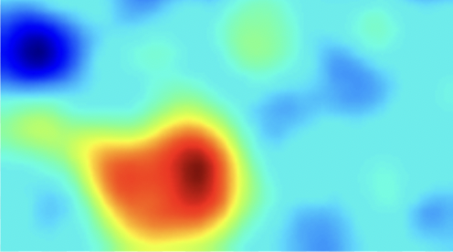

<head>
  <title> Intermediate Machine Learning </title>
  <link rel="stylesheet" href="theme/css/main.css" />
  <link rel="shortcut icon" type="image/x-icon" href="favicon.ico?">
</head>

Intermediate Machine Learning
===============================

S&DS 365 is a second course in machine learning at the advanced undergraduate or beginning graduate level. The course assumes familiarity with the basic ideas and techniques in machine learning, for example as covered in S&DS 265. The course treats methods together with mathematical frameworks that provide intuition and justifications for how and when the methods work. Assignments give students hands-on experience with machine learning techniques, to build the skills needed to adapt  approaches to new problems. Topics include nonparametric regression and classification, kernel methods, risk bounds, nonparametric Bayesian approaches, attention and language models, generative models, sparsity and manifolds, and reinforcement learning. Programming is central to the course, and is based on the Python programming language and Jupyter notebooks.

As prerequisites, students are expected to have a background in probability and statistics, at the level of S&DS 242 (Theory of Statistics), familiarity with the core ideas from linear algebra, for example through Math 222 (Linear Algebra with Applications), and computational skills at the level of S&DS 265 (Introductory Machine Learning) or CPSC 200 (Introduction to Information Systems). Background material can be found at the
[Introductory Machine Learning](http://introml.ydata123.org) (S&DS 265)  course site.

Computing for the course uses Python in Jupyter notebooks. These can be run using [Anaconda](https://www.anaconda.com/products/individual) with the [IML environment](https://raw.githubusercontent.com/YData123/sds365-sp22/main/env/IML_env.yml) that includes the packages we'll need <a href="https://raw.githubusercontent.com/YData123/sds365-sp22/main/env/IML_env.zip" download>(click here to download)</a>
; instructions for installing this environment are available on [Yale Canvas](https://canvas.yale.edu).  The notebooks can also be run in [Google Colab](https://colab.research.google.com) by clicking on the  icon.

Readings marked  are written at a more advanced and technical level, and give further detail and as a complement to what is presented in class; students are not responsible for the parts that are not discussed in lecture. Additional readings are listed as "Readings: PML" and refer to sections in the book [Probabilistic Machine Learning: An Introduction](https://probml.github.io/pml-book/book1.html), by Kevin Murphy, MIT Press, 2022 (forthcoming).

Calendar Spring 2022
---
Lectures: Monday/Wednesday 11:30-12:50

Week | Dates |  Topics | Demos & Tutorials |  Lecture Slides | Readings & Notes | Assignments & Exams
----------- | ----------- | ------------- | ------------ | ------------- | ------------- | -----------
1 | Jan 26, 28 |    Course overview |   [Python elements](https://github.com/YData123/sds265-fa21/raw/main/demos/python/python-elements.zip)      [Pandas and regression](https://github.com/YData123/sds265-fa21/raw/main/demos/covid-trends/covid-trends.zip)    [Lasso example](https://github.com/YData123/sds365-sp22/raw/main/demos/lasso/lasso-example.zip)  | Jan 26: [Course overview](https://github.com/YData123/sds365-sp22/raw/main/lectures/lecture-jan-26.pdf)   Jan 28: [Sparse regression](https://github.com/YData123/sds365-sp22/raw/main/lectures/lecture-jan-28.pdf) | PML Section 11.4  |
2 | Jan 31, Feb 2 | Smoothing and kernels |   [Smoothing example](https://github.com/YData123/sds365-sp22/raw/main/demos/smoothing/smoothing-demo.zip)    [Using different kernels](https://github.com/YData123/sds365-sp22/raw/main/demos/smoothing/smoothing-demo2.zip)    [Mercer kernels](https://github.com/YData123/sds365-sp22/raw/main/demos/mercer_kernels/mercer-kernel-demo.zip) | Jan 31: [Smoothing](https://github.com/YData123/sds365-sp22/raw/main/lectures/lecture-jan-31.pdf)   Feb 2: [Mercer Kernels](https://github.com/YData123/sds365-sp22/raw/main/lectures/lecture-feb-2.pdf)   | PML Sections 16.3, 17.1    [Notes on Mercer kernels](https://github.com/YData123/sds365-sp22/raw/main/notes/mercer-kernels.pdf)|
3 | Feb 7, 9 | Density estimation and risk bounds  |  [Density estimation demo](https://github.com/YData123/sds365-sp22/raw/main/demos/smoothing/smoothing-demo3.zip)  | Feb 7, 9: [Sync up](https://github.com/YData123/sds365-sp22/raw/main/lectures/lecture-feb-7.pdf) | [Bias-variance tradeoff for density estimation](https://github.com/YData123/sds365-sp22/raw/main/notes/kernel-bias-variance.pdf) |  Feb 9:  [Assn1 out](https://github.com/YData123/sds365-sp22/raw/main/assignments/assn1/assn1.zip)
4 | Feb 14, 16 | Neural networks for classification | [TensorFlow playground](https://playground.tensorflow.org/)    [Convolution demo](https://github.com/YData123/sds365-sp22/raw/main/demos/convolution/convolve_demo.zip)    [Problem 4 warmup](https://github.com/YData123/sds365-sp22/raw/main/demos/convolution/brain-food.zip) | Feb 9: [Neural networks](https://github.com/YData123/sds365-sp22/raw/main/lectures/lecture-feb-9.pdf)   Feb 14: [Convolutional neural networks](https://github.com/YData123/sds365-sp22/raw/main/lectures/lecture-feb-14.pdf)   Feb 16: [CNNs continued](https://github.com/YData123/sds365-sp22/raw/main/lectures/lecture-feb-16.pdf) | PML Sections 13.1, 13.2   [Notes on backpropagation](https://github.com/YData123/sds265-fa21/raw/main/notes/backprop.pdf) | Feb 16: [Quiz 1](https://yale.instructure.com/courses/76095/quizzes/51447)
5 | Feb 21, 23 | Nonparametric Bayes |  [Parametric Bayes](https://github.com/YData123/sds265-fa21/raw/main/demos/bayes/bayes.zip)     [Gaussian process demo](https://github.com/YData123/sds365-sp22/raw/main/demos/gaussian_processes/gp_demo.zip)    [Dirichlet process demo](https://github.com/YData123/sds365-sp22/raw/main/demos/dirichlet_processes/dp_demo.zip) |  Feb 21: [Gaussian processes](https://github.com/YData123/sds365-sp22/raw/main/lectures/lecture-feb-21.pdf)   Feb 23: [Gaussian and Dirichlet processes](https://github.com/YData123/sds365-sp22/raw/main/lectures/lecture-feb-23.pdf)  | PML Section 17.2   [Notes on Bayesian inference](https://github.com/YData123/sds265-fa21/raw/main/notes/bayes-notes.pdf)   [Notes on nonparametric Bayes](https://github.com/YData123/sds365-sp22/raw/main/notes/nonparametric-bayes.pdf) |  Feb 23: Assn 1 in;  [Assn2 out](https://github.com/YData123/sds365-sp22/raw/main/assignments/assn2/assn2.zip)
6 | Feb 28, Mar 2 | Approximate inference |  | Feb 28: [Dirichlet processes](https://github.com/YData123/sds365-sp22/raw/main/lectures/lecture-feb-28.pdf)   Mar 2: [Gibbs sampling](https://github.com/YData123/sds365-sp22/raw/main/lectures/lecture-mar-02.pdf)  |  [Notes on variational inference](https://github.com/YData123/sds365-sp22/raw/main/notes/variational.pdf) | Mar 2: [Quiz 2](https://yale.instructure.com/courses/76095/quizzes/51694)
7 | Mar 7, 9 | Approaches to generative modeling |  |  | | Mar 9: Assn 2 in
8 | Mar 14, 16 |  Structure learning  |  |  | | Mar 16: Midterm exam
9 | Mar 28, 30 | Deep reinforcement learning | | | | Mar 30: Assn 3 out
10 | Apr 4, 6 | Policy gradient methods |  |  | | Apr 6: Quiz 3
11 | Apr 11, 13 | Sequential and sequence-to-sequence  models |  | | | Apr 13: Assn 3 in; Assn 4 out
12 | Apr 18, 20 | Attention and language models |  | | | Apr 20: Quiz 4
13 | Apr 25, 27 | Special topics and review |  |  | | Apr 27: Assn 4 in
   | May 7  | Final exam, 2pm location TBD | | | | [Registrar: final exam schedule](http://catalog.yale.edu/ycps/final-examination-schedules/)

