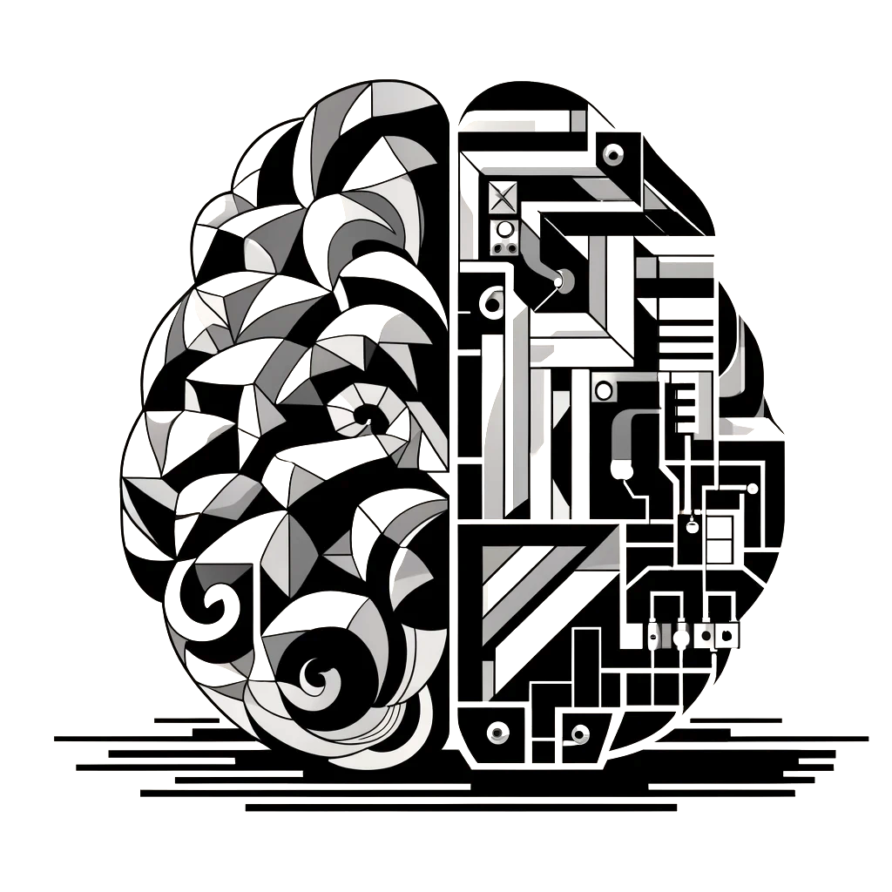

<head>
  <title> Introductory Machine Learning </title>
  <link rel="stylesheet" href="theme/css/main.css" />
  <link rel="shortcut icon" type="image/x-icon" href="favicon.ico?">
</head>

<!--
<small>
DALL-E's proud description of its own work: 
"A black and white 2-dimensional Cubist drawing that abstractly portrays a computer and a brain. 
It blends technological and intellectual elements in a striking monochromatic composition."
</small>
-->

Introductory Machine Learning
====

S&DS 265 introduces some of the key ideas and techniques in machine learning. Algorithms and concepts are presented to build intuition for how different methods work, without advanced mathematics. Assignments give students hands-on experience with the methods on different types of data. Topics include linear regression and classification, tree-based methods, topic models, language models, word embeddings, two-layer and recurrent neural networks, reinforcement learning, and an introduction to deep learning. Examples come from a variety of sources including political speeches, archives of scientific articles, real estate listings, and natural images. Programming is central to the course, and is based on the Python programming language.

Computing for the course uses Python in Jupyter notebooks.  All of the the notebooks can be run in [Google Colab](https://colab.research.google.com) by clicking on the  icon.

 

Calendar Spring 2026
---
Lectures: Monday/Wednesday 1:00-2:15pm
 
[Davies Auditorium](https://map.yale.edu/?id=1910#!m/563685?ct/52707)

Complementary readings marked ISL refer to sections in the book [An Introduction to Statistical Learning](https://www.statlearning.com/) (Python version, July 2023). Assignments and quizzes are posted and due on Thursday in a given week.
 

<!--Sunday, December 4: Canvas is currently down, across courses.  -->

 Week | Dates |  Topics | Demos & Tutorials | Lecture Slides | Readings and Notes | Assignments & Exams 
----------- | ----------- | ------------- | ------------ | ------------- | ----------- | ------------
1 | Jan 12, 14 |    Course overview; Python and background concepts |   Python elements     Covid trends   | Mon: [Course overview](https://github.com/YData123/sds265-sp26/raw/main/lectures/lecture-jan-12.pdf)   Wed: [Python and Pandas](https://github.com/YData123/sds265-sp26/raw/main/lectures/lecture-jan-14.pdf) | [Data8 Chapters 3](https://www.inferentialthinking.com/chapters/03/programming-in-python.html), [4](https://www.inferentialthinking.com/chapters/04/Data_Types.html), [5](https://www.inferentialthinking.com/chapters/05/Sequences.html) |  
2 | Jan 21, 23| Linear regression and classification |  Covid trends (revisited)     Classification examples  |  Mon: MLK day   Wed: [Regression concepts](https://github.com/YData123/sds265-sp26/raw/main/lectures/lecture-jan-21.pdf)    Fri: [Classification](https://github.com/YData123/sds265-sp26/raw/main/lectures/lecture-jan-23.pdf) | ISL Sections 3.1, 3.2, 3.5   Notes on [regression](https://github.com/YData123/sds265-fa22/raw/master/notes/linear_regression.pdf)   ISL Sections 4.3, 4.4   [Notes on classification](https://github.com/YData123/sds265-fa22/raw/master/notes/linear_classification.pdf) |    Assn 1 out
3 | Jan 26,28 | Stochastic gradient descent |  SGD examples  |  Mon: [Classification (continued)](https://github.com/YData123/sds265-sp26/raw/main/lectures/lecture-jan-26.pdf)   Wed: [Stochastic gradient descent](https://github.com/YData123/sds265-sp26/raw/main/lectures/lecture-jan-28.pdf) | ISL Section 6.2.2   ISL Section 10.7.2 | [Quiz 1](https://yale.instructure.com/courses/115661/quizzes)    
4 | Feb 2, 4 | Bias and variance, cross-validation |   Bias-variance tradeoff     Covid trends (revisited)    California housing | Mon: [Bias and variance](https://github.com/YData123/sds265-sp26/raw/main/lectures/lecture-feb-2.pdf)   Wed: [Cross-validation](https://github.com/YData123/sds265-sp26/raw/main/lectures/lecture-feb-4.pdf) | ISL Section 2.2   ISL Section 5.1 | Assn 1 in    Assn 2 out   |
5 | Feb 9, 11 | Tree-based methods and   principal components |  Trees and forests   [Visualizing trees](http://www.r2d3.us/visual-intro-to-machine-learning-part-1/)    PCA examples |   Mon: [Trees (and Forests)](https://github.com/YData123/sds265-sp26/raw/main/lectures/lecture-feb-9.pdf)   Wed: [Forests and PCA](https://github.com/YData123/sds265-sp26/raw/main/lectures/lecture-feb-11.pdf) | ISL Sections 8.1, 8.2   ISL Section 12.2  |  [Quiz 2](https://yale.instructure.com/courses/115661/quizzes)  
6 | Feb 16, 18 | PCA and dimension reduction |  PCA revisited    Used for dimension reduction     Word embeddings | Mon: [PCA and word embeddings](https://github.com/YData123/sds265-sp26/raw/main/lectures/lecture-feb-16.pdf)   Wed: [Embeddings and review](https://github.com/YData123/sds265-sp26/raw/main/lectures/lecture-feb-18.pdf) | ISL Section 12.2 |   Assn 2 in    Assn 3 out   
7 | Feb 23, 25 | Language models, Bayes, topic models |   Bayesian inference   Topic models |  Mon: [Language models](https://github.com/YData123/sds265-sp26/raw/main/lectures/lecture-feb-23.pdf)   Wed: [Bayesian inference](https://github.com/YData123/sds265-sp26/raw/main/lectures/lecture-feb-25.pdf) | [OpenAI: Better language models](https://openai.com/blog/better-language-models/)   [Notes on Bayesian inference](https://github.com/YData123/sds265-fa22/raw/master/notes/bayes-notes.pdf) <!--  [Notes on simulation](https://github.com/YData123/sds265-fa22/raw/master/notes/simulation.pdf)--> | [Quiz 3](https://yale.instructure.com/courses/115661/quizzes)   
8 | March 2,4  |  Midterm exam (in class) |  | Mon: Review   Wed: Exam | On Canvas:   [Practice midterms](https://yale.instructure.com/courses/115661/files/folder/practice_midterms) / [Sample solns](https://yale.instructure.com/courses/115661/files/folder/practice_midterms/)   [Midterm](https://yale.instructure.com/courses/115661/files/folder/midterm/) / [Sample soln](https://yale.instructure.com/courses/115661/files/folder/midterm/)
9 | Mar 23,25 | Topic models, introduction to neural networks |   Sanity check    Minimal neural network     Regression examples |  Mon: [ Topic models](https://github.com/YData123/sds265-sp26/raw/main/lectures/lecture-mar-23.pdf)   Wed: [Neural networks](https://github.com/YData123/sds265-sp26/raw/main/lectures/lecture-mar-29.pdf) |  ISL Sections 10.1, 10.2 |   Assn 3 in    Assn 4 out 
10 | Mar 30, Apr 1 | Neural networks, reinforcement learning |   Q-learning |    Mon: [Neural networks (continued)](https://github.com/YData123/sds265-sp26/raw/main/lectures/lecture-mar-30.pdf)   Wed: [Reinforcement learning](https://github.com/YData123/sds265-sp26/raw/main/lectures/lecture-apr-1.pdf) | [Notes on backpropagation](https://github.com/YData123/sds265-fa22/raw/master/notes/backprop.pdf) | [Quiz 4](https://yale.instructure.com/courses/115661/quizzes)   
11 | Apr 6, 8 | Deep neural networks |  [Tensorflow playground](https://playground.tensorflow.org/)    Autoencoder examples   |  Mon: [ Deep reinforcement learning](https://github.com/YData123/sds265-sp26/raw/main/lectures/lecture-apr-6.pdf)   Wed: [Autoencoders and LLMs](https://github.com/YData123/sds265-sp26/raw/main/lectures/lecture-apr-8.pdf) | ISL Section 10.7  |  Assn 4 in    Assn 5 out
12 | Apr 13, 15 | Transformers and LLMs |  Attention    GPT-4 Python API |   Mon: [Transformers](https://github.com/YData123/sds265-sp26/raw/main/lectures/lecture-apr-13.pdf)   Wed: [LLM scaling and finetuning](https://github.com/YData123/sds265-sp26/raw/main/lectures/lecture-apr-15.pdf) |  | [Quiz 5](https://yale.instructure.com/courses/115661/quizzes)   
13 | Apr 20, 22 | Societal issues for machine learning  | |  Mon: [Panel discussion](https://github.com/YData123/sds265-sp26/raw/main/lectures/lecture-apr-20.pdf)   Wed: [Course wrap up, iML Survivor](https://github.com/YData123/sds265-sp26/raw/main/lectures/lecture-apr-22.pdf) | | Assn 5 in  
14 | Monday May 4, 2pm | Final exam  | | | [Registrar: Final exam schedule](https://registrar.yale.edu/general-information/final-exams/)   [Practice finals](https://yale.instructure.com/courses/115661/files/folder/practice_finals/)

 
 